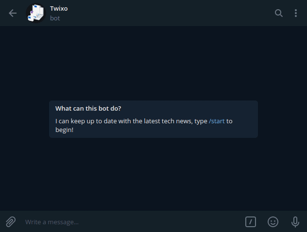

# Twixo - The Technology News Bot



Twixo is a Telegram bot that can give you updates on the top latest technology news from Techcrunch, TheNextWeb, The Verge, Techradar, and Wired.

## Built With

- Ruby
- Telegram Bot API
- News API
- RSpec
- Rubocop

<!-- ## Live Demo

Visit the live version on the link above.

[link]() -->


## Getting Started

#### Get Twixo
- Visit [here](http://t.me/TwixoBot) to start using Twixo

#### Run Your Bot Locally

- Install ruby language on your machine [here](https://www.ruby-lang.org/en/downloads/)
- Create a Telegram account [here](https://web.telegram.org/#/login) 
- Create a Telegram bot [here](https://t.me/botfather) Click on 'Send Message' and enter `/start`, then `/newbot` and follow the instructions
- Save the Token, it will be used in the next steps.
- Create an account at [newsapi.org](https://newsapi.org/) and save the API key.

- Use `git clone https://github.com/gscarv13/twixo-bot.git`
- Move to the directory where the project was cloned to. 
- Install the dependencies with
```terminal
$ bundle install
```
- Open the `lib/news.rb` file and change the line 9:
 ```ruby
  NEWS_API = 'ADD_NEWS_API_KEY_HERE'
 ```
- Open the `lib/bot.rb` file and change the line 8:
 ```ruby
  @token = 'ADD_BOT_TOKEN_HERE'
 ```
Alternatively, it is possible to add both the `NEWS_API` and `BOT_TOKEN` to an environment variable
file using the `dotenv` gem.
- Create a `token.env` file
- Add the following lines
```
BOT='ADD_BOT_TOKEN_HERE'
SOURCE='ADD_NEWS_API_KEY_HERE'
```
- Open the `lib/news.rb` file and change the line 9 to:
 ```ruby
  NEWS_API = ENV['SOURCE']
 ```
- Open the `lib/bot.rb` file and change the line 8 to:
 ```ruby
  @token = ENV['BOT']
 ```

- Finally, run your bot from the root directory with the command
```terminal
$ ruby bin/main.rb
```

## Interact With The Bot

Once the bot is running you can type `/start` to see the bot options.
Enter one of the source options and the bot will send the top news on the chat

## Running RSpec

First, Install RSpec with gem command in the terminal
```terminal
$ gem install rspec
```
Or install with bundle (Gemfile already included)
```terminal
$ bundle install
```
To run the tests will be necessary to add your `NEWS_API` to the `lib/news.rb` file
or to the `.env` file as mentioned above

- Enter `rspec` from the root directory.

## Authors

👤 **Gustavo Carvalho**

- GitHub: [@gscarv13](https://github.com/gscarv13)
- Twitter: [@Gscarv13](https://twitter.com/Gscarv13)
- LinkedIn: [Gustavo Carvalho](https://www.linkedin.com/in/gscarv13/)

## 🤝 Contributing

Contributions, issues, and feature requests are welcome!

Feel free to leave your suggestion on the [issues page](https://github.com/gscarv13/HTML-CSS-Capstone/issues).

## Show your support

Give an ⭐️ if you like this project!

## 📝 License

This project is [MIT](https://opensource.org/licenses/mit-license.php) licensed.
